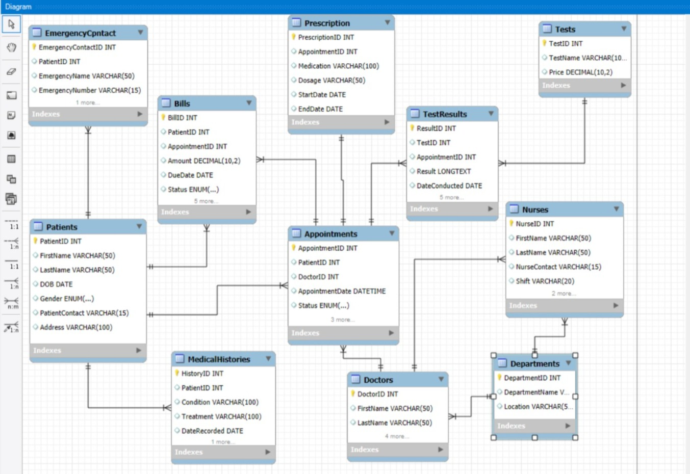

# Hospital Management System

A relational database project designed to manage hospital operations including patients, doctors, appointments, prescriptions, billing, and medical records.

## Project Scope
The system is designed to improve hospital operational efficiency through an integrated database structure that securely manages patient and medical information.

## Features
- Patient management
- Doctor scheduling
- Appointment tracking
- Prescription management
- Medical history records
- Billing system
- Laboratory test tracking

## Technologies & Tools
- SQL
- MySQL
- MySQL Workbench

## Concepts Applied
- Database normalization
- Primary & foreign keys
- CRUD operations
- Relational schema design
- Data integrity constraints

 ## Entity Relationship Diagram

The following ER diagram illustrates the relational database structure and entity relationships used in the Hospital Management System.

## Database Entities
- Patients
- Doctors
- Appointments
- Prescriptions
- MedicalHistories
- Nurses
- Departments
- Bills
- Tests
- TestResults

## Author
Tina Sadreddini
